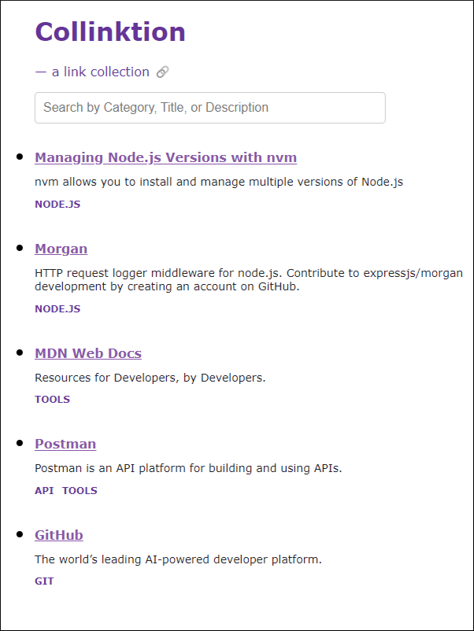

# Collinktion 🔗

This project was built to explore Gatsby for frontend design and has been deployed on Cloudflare Pages.  
On the backend, a Cloudflare Worker is used to fetch data from a Kintone database app containing weblinks imported from an external source.  

### Project Status: 👷‍♀️ In Progress 🏗️

## ✨ [Live Demo](https://collinktion.pages.dev/) ✨

## Features 

Client-side search functionality enables users to find links by Category, Title, or Description.

## Further Development Plans

- Implement pagination
- Implement functionality to browse various categories via button clicks
- Data cleansing to remove duplicate links before importing into Kintone